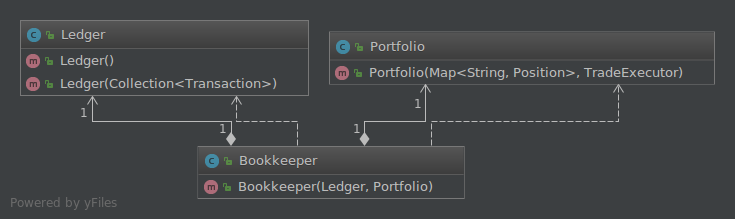

# Beyond JUnit
## Testing With Hamcrest Matchers

---

# Agenda
* What is a Matcher?
* Why should I use them?
* Lots of examples
* Hamcrest Matchers vs. Mockito Matchers
* Implementing the Matcher interface

---

# What is a Matcher?
* An object allowing 'match' rules to be defined declaratively
* Hamcrest is not a test framework, but Matchers are very useful in tests

---

# Why should I use Matchers?
* Allows writing flexible tests without overspecifying expected behavior
* Tests can be written in a sort of mini-DSL, which can help you test intended behavior rather than implementation

---

# Mocking
You've probably used Mockito.

It's likely you've been using it wrong.

## Rules To Mock By
Mock behavior, not data

Don't mock out the getters on a POJO.  Just make an instance of it. <!-- .element: class="fragment" data-fragment-index="1" -->

Builders can help.                                                  <!-- .element: class="fragment" data-fragment-index="2" -->

## Rules To Mock By
Mock collaborators

Don't mock the object under test.  Mock out its collaborators. <!-- .element: class="fragment" data-fragment-index="1" -->

You should only be interested in testing one unit at a time.  <!-- .element: class="fragment" data-fragment-index="2" -->

## Rules To Mock By
Never mock something you don't own

This leads to brittle tests.                                                <!-- .element: class="fragment" data-fragment-index="1" -->

The interface can change without warning when you update your dependencies. <!-- .element: class="fragment" data-fragment-index="2" -->

Put your own interface in front of those objects.                           <!-- .element: class="fragment" data-fragment-index="3" -->

---

# Given, When, Then
* Given describes the state of the system before you test           <!-- .element: class="fragment" data-fragment-index="1" -->
* When describes the behavior you're testing                        <!-- .element: class="fragment" data-fragment-index="2" -->
* Then describes the changes you expect as a result of the behavior <!-- .element: class="fragment" data-fragment-index="3" -->

Matchers help us out in the Given and Then sections.                <!-- .element: class="fragment" data-fragment-index="4" -->

---

# Test Specification
    Feature: User trades stocks
      Scenario: User requests a sell before close of trading
        Given I have 100 shares of MSFT stock
          And I have 150 shares of APPL stock
          And the time is before close of trading

        When I ask to sell 20 shares of MSFT stock
         
        Then I should have 80 shares of MSFT stock
          And I should have 150 shares of APPL stock
          And a sell order for 20 shares of MSFT stock should 
            have been executed

# Test Setup
    private TradeClock clock;
    private MarketDao marketDao;
    private Portfolio portfolio;

    @Before
    public void setUp() {
        clock = mock(TradeClock.class);
        marketDao = mock(MarketDao.class);

        // Given
        portfolio = new Portfolio.Builder()
                .withPosition(new Position("MSFT", 100.0))
                .withPosition(new Position("APPL", 150.0))
                .withTradeExecutor(
                    new TradeExecutor(clock, marketDao))
                .build();
    }

# Typical Test
    @Test
    public void userTradesStocks() throws MarketClosedException {
        // Given
        when(clock.isMarketOpen()).thenReturn(true);

        Trade sellOrder = new SellOrder("MSFT", -20.0);
        when(marketDao.execute(sellOrder))
            .thenReturn(new Transaction(sellOrder));

        // When
        portfolio.trade(sellOrder);

        // Then
        assertEquals(new Position("MSFT", 80.0),
            portfolio.getPosition("MSFT").orElse(null));
        assertEquals(new Position("APPL", 150.0),
            portfolio.getPosition("APPL").orElse(null));

        // This last part must have happened right?
        // And a sell order for 20 shares of MSFT stock should
        // have been executed
    }

# Improved Test
    @Test
    public void userTradesStocks() throws MarketClosedException {
        // Given
        when(clock.isMarketOpen()).thenReturn(true);

        Trade sellOrder = new SellOrder("MSFT", 20.0);
        when(marketDao.execute(sellOrder)).thenReturn(new Transaction(sellOrder));

        // When
        portfolio.trade(sellOrder);

        // Then
        assertThat(portfolio, hasPosition(new Position("MSFT", 80.0)));
        assertThat(portfolio, hasPosition(new Position("APPL", 150.0)));

        verify(marketDao).execute(sellOrder);
    }

# Compare
Typical Assertion

    assertEquals(new Position("MSFT", 80.0),
        portfolio.getPosition("MSFT").orElse(null));

Assertion Using Matcher

    assertThat(portfolio,
        hasPosition(new Position("MSFT", 80.0)));

---

Let's look at another example...

## Test Specification
    Feature: User attempts to trade stocks after hours
        Scenario: User requests a sell after close of trading
     
        Given I have 100 shares of MSFT stock
          And I have 150 shares of APPL stock
          And the time is after close of trading
     
        When I ask to sell 20 shares of MSFT stock
     
        Then I should have 100 shares of MSFT stock
          And I should have 150 shares of APPL stock
          And no sell orders should have been executed

## Typical Test
    @Test(expected = MarketClosedException.class)
    public void afterHoursTradeIsRejected()
        throws MarketClosedException {
        
        // Given
        Trade sellOrder = new SellOrder("MSFT", -20.0);

        // When
        portfolio.trade(sellOrder);

        // Then
        // And no sell orders should have been executed
    }

## Improved Test
    @Test
    public void afterHoursTradeIsRejected()
        throws MarketClosedException {
        
        // Given
        when(clock.isMarketOpen()).thenReturn(false);

        try {
            // When
            portfolio.trade(new SellOrder("MSFT", -20.0));
            fail("Expected a MarketClosedException to be thrown.");
        } catch (MarketClosedException e) {
            // Then
            assertThat(portfolio, hasPosition(new Position("MSFT", 100.0)));
            assertThat(portfolio, hasPosition(new Position("APPL", 150.0)));

            verify(marketDao, never())
                .execute(any(Trade.class)); // Mockito matcher
        }
    }

---

Users don't interact with the Portfolio directly, they issue commands to a Bookkeeper.

So let's test that too.

## Test Specification
    Feature: User buys and sells some stocks
    Scenario: User requests a buy and a sell before close of
      trading
     
    Given I have 100 shares of MSFT stock
      And I have 150 shares of APPL stock
      And the time is after close of trading
     
    When I ask to buy 120 shares of APPL stock
      And I ask to sell 50 shares of APPL stock
     
    Then I should have 100 shares of MSFT stock
      And I should have 220 shares of APPL stock
      And a buy order for 120 shares of APPL stock should have
        been executed
      And a transaction for +120 shares of APPL stock should
        have been recorded in the Ledger
      And a sell order for 50 shares of APPL stock should have
        been executed
      And a transaction for -50 shares of APPL stock should have
        been recorded in the Ledger

## Typical Test
    @Test
    public void userTradesMultipleStocks() throws MarketClosedException {
        // Given
        when(clock.isMarketOpen()).thenReturn(true);

        Trade buyOrder = new BuyOrder("APPL", 120.0);
        Trade sellOrder = new SellOrder("APPL", 50.0);
        when(marketDao.execute(buyOrder))
            .thenReturn(new Transaction(buyOrder));
        when(marketDao.execute(sellOrder))
            .thenReturn(new Transaction(sellOrder));

        Ledger ledger = new Ledger();
        Bookkeeper bookkeeper = new Bookkeeper(ledger, portfolio);

        // When
        bookkeeper.submit(buyOrder);
        bookkeeper.submit(sellOrder);

        // Then
        assertEquals(2, ledger.getTransactions().stream()
                .filter(transaction 
                    -> transaction.getSymbol().equals("APPL"))
                .mapToDouble(Transaction::getUnitsAdjustment)
                .filter(amount 
                    -> amount == -50.0 || amount == 120.0)
                .count());

        assertEquals(0, portfolio.getPositions().stream()
                .filter(position -> !Objects.equals(
                    new Position("MSFT", 100.0),
                    position))
                .filter(position -> !Objects.equals(
                    new Position("APPL", 220.0),
                    position))
                .count());

        // And a buy order for 120 shares of APPL stock should have been executed
        // And a sell order for 50 shares of APPL stock should have been executed
    }

## Improved Test
    @Test
    public void userTradesMultipleStocks() throws MarketClosedException {
        when(clock.isMarketOpen()).thenReturn(true);

        Trade buyOrder = new BuyOrder("APPL", 120.0);
        Trade sellOrder = new SellOrder("APPL", 50.0);
        when(marketDao.execute(eq(buyOrder)))
            .thenReturn(new Transaction(buyOrder));
        when(marketDao.execute(eq(sellOrder)))
            .thenReturn(new Transaction(sellOrder));

        Ledger ledger = spy(new Ledger()); // Spy!!
        Bookkeeper bookkeeper = new Bookkeeper(ledger, portfolio);

## Improved Test
        // When
        bookkeeper.submit(buyOrder);
        bookkeeper.submit(sellOrder);

## Improved Test
        // Then
        assertThat(portfolio,
            hasPosition(new Position("MSFT", 100.0)));
        assertThat(portfolio,
            hasPosition(new Position("APPL", 220.0)));

## Improved Test
        verify(marketDao).execute(buyOrder);
        verify(marketDao).execute(sellOrder);

## Improved Test
        assertThat(ledger,
            hasTransaction(new Transaction("APPL", 120.0)));
        assertThat(ledger,
            hasTransaction(new Transaction("APPL", -50.0)));

## Improved Test
        ArgumentCaptor<Transaction> transactionCaptor
            = ArgumentCaptor.forClass(Transaction.class);

        verify(ledger, times(2))
            .record(transactionCaptor.capture());

        assertThat(transactionCaptor.getAllValues(), hasItems(
                new Transaction("APPL", 120.0),
                new Transaction("APPL", -50.0)));
    }

---

# The Matcher Interface

## Matcher
    public interface Matcher<T> extends SelfDescribing {
        /** performs the matching */
        boolean matches(Object item);
        
        /** describe what was actually found */
        void describeMismatch(
            Object item,
            Description mismatchDescription);
    }
    
    public interface SelfDescribing {
        /** describe what is expected */
        void describeTo(Description description);
    }

You usually want to extend TypeSafeMatcher, however

## Type Safe Matcher
    public abstract class TypeSafeMatcher<T>
        extends BaseMatcher<T> {
        
        protected abstract boolean matchesSafely(T item);
        
        protected void describeMismatchSafely(
            T item,
            Description mismatchDescription) {
    }

## Portfolio Matcher
    public class PortfolioMatcher {

    public static TypeSafeMatcher<Portfolio> hasPosition(
        Position expectedPosition) {
        
        return new TypeSafeMatcher<Portfolio>() { ... };
    }

## matches Safaely
    @Override
    protected boolean matchesSafely(Portfolio portfolio) {
        Optional<Position> maybePosition
            = portfolio.getPosition(expectedPosition.getSymbol());
            
            return maybePosition.map(gotPosition 
                -> gotPosition.equals(expectedPosition))
                    .orElse(false);
        }

## describe To
    @Override
    public void describeTo(Description description) {
        // describe what is expected
        description.appendText("Portfolio should contain a "
            + expectedPosition);
    }

## describe Mismatch Safely
    @Override
    protected void describeMismatchSafely(
        Portfolio portfolio,
        Description mismatchDescription) {
        
        // describe what was actually found
        mismatchDescription.appendText("Portfolio contains ");
        mismatchDescription.appendText(portfolio.getPositions()
            .stream()
            .map(Position::toString)
            .collect(joining("\n")));
    }

# Failure Messages
Our new Matcher has a pretty great failure message without any further effort

    java.lang.AssertionError: 
    Expected: Portfolio should contain a Position{symbol='MSFT', units=80.0}
         but: Portfolio contains Position{symbol='MSFT', units=79.0}
    Position{symbol='APPL', units=150.0}

That's all there is to it

---

There are lots of great Matchers that ship with Hamcrest

Object Matchers

* equalTo 
* hasToString
* instanceOf, isCompatibleType
* notNullValue, nullValue
* sameInstance

Bean Matchers

* hasProperty

Collection Matchers
* array
* hasEntry, hasKey, hasValue
* hasItem, hasItems
* hasItemInArray

Number Matchers
* closeTo
* greaterThan
* greaterThanOrEqualTo
* lessThan
* lessThanOrEqualTo

String Matchers
* equalToIgnoringCase
* equalToIgnoringWhiteSpace
* containsString, endsWith, startsWith

Logical Matchers
* allOf
* anyOf
* not

Plus there are lots of third party Matchers available too!

# XmlAssertion
    @Test
    public void createBranchBuildJobForJenkins2UsesCorrectCredentialsID() {
        // test setup...

        String gotXML = client.createBuildJobXML(params);

        XmlAssertion.assertThat(gotXML)
            .node("maven2-moduleset")
            .node("scm")
            .node("locations")
            .node("hudson.scm.SubversionSCM_-ModuleLocation")
            .node("credentialsId")
            .matches("devbuild");
    }

---

Mockito also has Matchers

Don't confuse them

Mockito Matchers are used for parameters in a stubbed method call

    when(environmentsDao.loadEnvironment(any(String.class)))
        .thenReturn(environment);

But you can use the *argThat* method in Mockito to pass a Hamcrest Matcher when you really need to

    when(environmentsDao.loadEnvironment(
            argThat(containsString("fake-environment"))))
        .thenReturn(environment);

---

That's all I have

# Questions?

The slides and all of the code are available at

https://github.com/quincy/matchers-presentation
