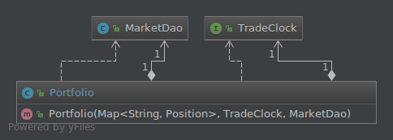

<!-- .slide: data-background="res/title.jpg" -->

---

## Beyond JUnit
### Testing With Hamcrest Matchers

Note: Hi I'm Quincy...

---

# Agenda
* What is a Matcher?
* Why should I use them?
* A brief discussion on Mocks
* Given, When, Then testing
* Examples
* Implementing the Matcher interface
* Existing Matchers

Note: Here is a brief overview of what we're going to talk about today

---

# What is a Matcher?
* An object allowing 'match' rules to be defined declaratively
* Hamcrest is not a test framework, but Matchers are very useful in tests
  * UI Validation
  * data filtering

---

# Why should I use Matchers?
* Allows writing flexible tests without over-specifying expected behavior
* Tests can be written in a sort of mini-DSL, which can help you test intended behavior rather than implementation

Note: This helps tests break less often when unimportant changes are made

---

# Mock Objects
You've probably used Mockito.

It's likely you've been using it wrong. <!-- .element: class="fragment" data-fragment-index="1" -->

## Rules To Mock By
Mock behavior, not data

Don't mock out the getters on a POJO.  Just make an instance of it. <!-- .element: class="fragment" data-fragment-index="1" -->

Builders can help.                                                  <!-- .element: class="fragment" data-fragment-index="2" -->

## Rules To Mock By
Mock collaborators (dependencies)

Don't mock the object under test.  Mock out its collaborators. <!-- .element: class="fragment" data-fragment-index="1" -->

You should only be interested in testing one unit at a time.  <!-- .element: class="fragment" data-fragment-index="2" -->

Note: Collaborators are the objects that your object under test interacts with in order to do its job

They are the things you should be injecting into your object

## Rules To Mock By
Never mock something you don't own

This leads to brittle tests.                                                <!-- .element: class="fragment" data-fragment-index="1" -->

The interface can change without warning when you update your dependencies. <!-- .element: class="fragment" data-fragment-index="2" -->

Put your own interface in front of those objects.                           <!-- .element: class="fragment" data-fragment-index="3" -->

---

# Given, When, Then
* Given some context                                            <!-- .element: class="fragment" data-fragment-index="1" -->
* When some action is carried out                               <!-- .element: class="fragment" data-fragment-index="2" -->
* Then a particular set of observable consequences should occur <!-- .element: class="fragment" data-fragment-index="3" -->

Matchers help us out in the Given and Then sections.            <!-- .element: class="fragment" data-fragment-index="4" -->

Note: Specification by Example

---

# Test Specification
    Feature: Portfolio trades stocks
      Scenario: Portfolio requests a sell before close of trading
     
      Given I have 100 shares of MSFT stock
        And I have 150 shares of APPL stock
        And the time is before close of trading
     
      When I ask to sell 20 shares of MSFT stock
     
      Then I should have 80 shares of MSFT stock
        And I should have 150 shares of APPL stock
        And a sell order for 20 shares of MSFT stock should have
          been executed

# Test Setup
    private TradeClock clock;
    private MarketDao marketDao;
    private Portfolio portfolio;

    @Before
    public void setUp() {
        clock = mock(TradeClock.class);
        marketDao = mock(MarketDao.class);

        portfolio = new Portfolio.Builder()
                // Given I have 100 shares of MSFT stock
                .withPosition(new Position("MSFT", 100.0))
                //   And I have 150 shares of APPL stock
                .withPosition(new Position("APPL", 150.0))
                .withTradeExecutor(new TradeExecutor(clock, marketDao))
                .build();
    }
<!-- .element style="font-size: 0.4em;" -->

Note: This setUp method will be used by all of our tests since they'll all have similar When sections

# Typical Test
    @Test
    public void userTradesStocks() throws MarketClosedException {
        // Given... And the time is before close of trading
        when(clock.isMarketOpen()).thenReturn(true);

        Trade sellOrder = new SellOrder("MSFT", 20.0);
        when(marketDao.execute(sellOrder)).thenReturn(new Transaction(sellOrder));

        // When I ask to sell 20 shares of MSFT stock
        portfolio.trade(sellOrder);

        // Then I should have 80 shares of MSFT stock
        assertEquals(new Position("MSFT", 80.0), portfolio.getPosition("MSFT").orElse(null));
        //   And I should have 150 shares of APPL stock
        assertEquals(new Position("APPL", 150.0), portfolio.getPosition("APPL").orElse(null));

        // This last part must have happened right?
        //   And a sell order for 20 shares of MSFT stock should have been executed
    }
<!-- .element style="font-size: 0.33em;" -->

# Improved Test
    @Test
    public void userTradesStocks() throws MarketClosedException {
        // Given... And the time is before close of trading
        when(clock.isMarketOpen()).thenReturn(true);

        Trade sellOrder = new SellOrder("MSFT", 20.0);
        when(marketDao.execute(sellOrder)).thenReturn(new Transaction(sellOrder));

        // When I ask to sell 20 shares of MSFT stock
        portfolio.trade(sellOrder);

        // Then I should have 80 shares of MSFT stock
        assertThat(portfolio, hasPosition(new Position("MSFT", 80.0)));
        //   And I should have 150 shares of APPL stock
        assertThat(portfolio, hasPosition(new Position("APPL", 150.0)));

        //   And a sell order for 20 shares of MSFT stock should have been executed
        verify(marketDao).execute(sellOrder);
    }
<!-- .element style="font-size: 0.38em;" -->

# Compare
Typical Assertion

    assertEquals(new Position("MSFT", 80.0),
        portfolio.getPosition("MSFT").orElse(null));

Assertion Using Matcher  <!-- .element: class="fragment" data-fragment-index="1" -->

    assertThat(portfolio,
        hasPosition(new Position("MSFT", 80.0)));
<!-- .element: class="fragment" data-fragment-index="1" -->

Note: The second assertion reads almost like your QA Analyst is talking you through it.

---

Let's look at another example...

## Test Specification
    Feature: Portfolio attempts to trade stocks after hours
      Scenario: Portfolio requests a sell after close of trading
     
      Given I have 100 shares of MSFT stock
        And I have 150 shares of APPL stock
        And the time is after close of trading
     
      When I ask to sell 20 shares of MSFT stock
     
      Then I should have 100 shares of MSFT stock
        And I should have 150 shares of APPL stock
        And no sell orders should have been executed

## Typical Test
    @Test(expected = MarketClosedException.class)
    public void afterHoursTradeIsRejected() throws MarketClosedException {
        // Given... And the time is before close of trading
        when(clock.isMarketOpen()).thenReturn(false);

        // When I ask to sell 20 shares of MSFT stock
        Trade sellOrder = new SellOrder("MSFT", 20.0);
        portfolio.trade(sellOrder);

        // No way to verify these things...
        // Then I should have 100 shares of MSFT stock
        //   And I should have 150 shares of APPL stock
        //   And no sell orders should have been executed
    }
<!-- .element style="font-size: 0.5em;" -->

## Improved Test
    @Test
    public void afterHoursTradeIsRejected() throws MarketClosedException {
        // Given... And the time is before close of trading
        when(clock.isMarketOpen()).thenReturn(false);

        try {
            // When I ask to sell 20 shares of MSFT stock
            portfolio.trade(new SellOrder("MSFT", 20.0));
            fail("Expected a MarketClosedException to be thrown.");
        } catch (MarketClosedException e) {
            // Then I should have 100 shares of MSFT stock
            assertThat(portfolio, hasPosition(new Position("MSFT", 100.0)));
            
            //   And I should have 150 shares of APPL stock
            assertThat(portfolio, hasPosition(new Position("APPL", 150.0)));

            //   And no sell orders should have been executed
            verify(marketDao, never()).execute(any(Trade.class)); // Mockito matcher
        }
    }
<!-- .element style="font-size: 0.40em;" -->

---

Users don't interact with the Portfolio directly

They issue commands to a Bookkeeper

Note: Lets write a more complicated test.

## Test Specification
    Feature: User buys and sells some stocks
      Scenario: User requests a buy and a sell before close of trading
     
      Given the time is before close of trading
     
      When I ask to buy 120 shares of APPL stock
        And I ask to sell 50 shares of APPL stock
     
      Then a buy order for 120 shares of APPL stock should have been executed
        And a sell order for 50 shares of APPL stock should have been executed
        And a transaction for +120 shares of APPL stock should have been recorded in the Ledger
        And a transaction for -50 shares of APPL stock should have been recorded in the Ledger
<!-- .element style="font-size: 0.39em;" -->

## Typical Test
    @Test
    public void userTradesMultipleStocks() throws MarketClosedException {
        // And the time is before close of trading
        when(clock.isMarketOpen()).thenReturn(true);
<!-- .element style="font-size: 0.50em;" -->

## Typical Test
    Trade buyOrder = new BuyOrder("APPL", 120.0);
    Trade sellOrder = new SellOrder("APPL", 50.0);
    when(marketDao.execute(eq(buyOrder)))
            .thenReturn(new Transaction(buyOrder));
    when(marketDao.execute(eq(sellOrder)))
            .thenReturn(new Transaction(sellOrder));

    Ledger ledger = Mockito.spy(new AccountingLedger());
    Bookkeeper bookkeeper = new Bookkeeper(ledger, portfolio);

    // When I ask to buy 120 shares of APPL stock
    //   And I ask to sell 50 shares of APPL stock
    bookkeeper.submit(buyOrder);
    bookkeeper.submit(sellOrder);
<!-- .element style="font-size: 0.54em;" -->

## Typical Test
    // Then a buy order for 120 shares of APPL stock should have been executed
    verify(marketDao).execute(buyOrder);
    //   And a sell order for 50 shares of APPL stock should have been executed
    verify(marketDao).execute(sellOrder);

    //   And a transaction for +120 shares of APPL stock should have been recorded
    //     in the Ledger
    assertThat(ledger, hasTransaction(new Transaction("APPL", 120.0)));
    //   And a transaction for -50 shares of APPL stock should have been recorded
    //     in the Ledger
    assertThat(ledger, hasTransaction(new Transaction("APPL", -50.0)));
    
    assertThat(portfolio, hasPosition(new Position("MSFT", 100.0)));
    assertThat(portfolio, hasPosition(new Position("APPL", 220.0)));
<!-- .element style="font-size: 0.45em;" -->

## Improved Test
    @Test
    public void userTradesMultipleStocks() throws MarketClosedException {
        // And the time is before close of trading
        when(clock.isMarketOpen()).thenReturn(true);
<!-- .element style="font-size: 0.5em;" -->

## Improved Test
    Trade buyOrder = new BuyOrder("APPL", 120.0);
    Trade sellOrder = new SellOrder("APPL", 50.0);
    Transaction buyTransaction = new Transaction("APPL", 120.0);
    Transaction sellTransaction = new Transaction("APPL", -50.0);

    Ledger ledger = mock(Ledger.class);

    Portfolio portfolio = mock(Portfolio.class);
    when(portfolio.trade(eq(buyOrder))).thenReturn(buyTransaction);
    when(portfolio.trade(eq(sellOrder))).thenReturn(sellTransaction);

    Bookkeeper bookkeeper = new Bookkeeper(ledger, portfolio);

    // When I ask to buy 120 shares of APPL stock
    //   And I ask to sell 50 shares of APPL stock
    bookkeeper.submit(buyOrder, sellOrder);
<!-- .element style="font-size: 0.5em;" -->

## Improved Test
    ArgumentCaptor<Trade> tradeCaptor = ArgumentCaptor.forClass(Trade.class);

    verify(portfolio, times(2)).trade(tradeCaptor.capture());
    List<Trade> trades = tradeCaptor.getAllValues();

    // Then a buy order for 120 shares of APPL stock should have been executed
    assertThat(trades, hasItem(buyOrder));

    //   And a sell order for 50 shares of APPL stock should have been executed
    assertThat(trades, hasItem(sellOrder));
<!-- .element style="font-size: 0.45em;" -->

## Improved Test
    ArgumentCaptor<Transaction> transactionCaptor
            = ArgumentCaptor.forClass(Transaction.class);

    verify(ledger, times(2)).record(transactionCaptor.capture());
    List<Transaction> transactions = transactionCaptor.getAllValues();

    //   And a transaction for +120 shares of APPL stock should have been recorded
    //     in the Ledger
    assertThat(transactions, hasItem(buyTransaction));

    //   And a transaction for -50 shares of APPL stock should have been recorded
    //     in the Ledger
    assertThat(transactions, hasItem(sellTransaction));
<!-- .element style="font-size: 0.45em;" -->

# Compare
    assertThat(ledger, hasTransaction(new Transaction("APPL", 120.0)));
    assertThat(ledger, hasTransaction(new Transaction("APPL", -50.0)));
<!-- .element style="font-size: 0.45em;" -->

###### vs.
    ArgumentCaptor<Transaction> transactionCaptor
            = ArgumentCaptor.forClass(Transaction.class);

    verify(ledger, times(2)).record(transactionCaptor.capture());
    List<Transaction> transactions = transactionCaptor.getAllValues();

    assertThat(transactions, hasItem(buyTransaction));
    assertThat(transactions, hasItem(sellTransaction));
<!-- .element style="font-size: 0.45em;" -->

---

# The Matcher Interface

## Matcher
    public interface Matcher<T> extends SelfDescribing {
        /** performs the matching */
        boolean matches(Object item);
        
        /** describe what was actually found */
        void describeMismatch(
            Object item,
            Description mismatchDescription);
    }
    
    public interface SelfDescribing {
        /** describe what is expected */
        void describeTo(Description description);
    }

You usually want to extend TypeSafeMatcher, however

## Type Safe Matcher
    public abstract class TypeSafeMatcher<T>
        extends BaseMatcher<T> {
        
        protected abstract boolean matchesSafely(T item);
        
        protected void describeMismatchSafely(
            T item,
            Description mismatchDescription) {
    }

## Portfolio Matcher
    public class PortfolioMatcher {

    public static TypeSafeMatcher<Portfolio> hasPosition(
        Position expectedPosition) {
        
        return new TypeSafeMatcher<Portfolio>() { ... };
    }

Note: PortfolioMatcher could have many matchers available through convenient static methods.

Using the static import

    import static com.github.quincy.PortfolioMatcher.hasPosition;
    
    //...
    
    assertThat(portfolio,
        hasPosition(new Position("MSFT", 80.0)));

## matches Safely
    @Override
    protected boolean matchesSafely(Portfolio portfolio) {
        Optional<Position> maybePosition
            = portfolio.getPosition(expectedPosition.getSymbol());
            
            return maybePosition.map(gotPosition 
                -> gotPosition.equals(expectedPosition))
                    .orElse(false);
        }
<!-- .element style="font-size: 0.52em;" -->

## describe To
    @Override
    public void describeTo(Description description) {
        // describe what is expected
        description.appendText("Portfolio should contain a "
            + expectedPosition);
    }

## describe Mismatch Safely
    @Override
    protected void describeMismatchSafely(
        Portfolio portfolio,
        Description mismatchDescription) {
        
        // describe what was actually found
        mismatchDescription.appendText("Portfolio contains ");
        mismatchDescription.appendText(portfolio.getPositions()
            .stream()
            .map(Position::toString)
            .collect(joining("\n")));
    }

# Failure Messages
Our new Matcher has a pretty great failure message without any further effort

    java.lang.AssertionError: 
    Expected: Portfolio should contain a Position{symbol='MSFT', units=80.0}
         but: Portfolio contains Position{symbol='MSFT', units=79.0}
    Position{symbol='APPL', units=150.0}
<!-- .element style="font-size: 0.46em;" -->

Compare that with the type of failure messages you get from plain old JUnit assertions

    java.lang.AssertionError: 
    Expected :0
    Actual   :1

That's all there is to it

---

There are lots of great Matchers that ship with Hamcrest

Object Matchers

* equalTo 
* hasToString
* instanceOf, isCompatibleType
* notNullValue, nullValue
* sameInstance

Bean Matchers

* hasProperty

Collection Matchers
* array
* hasEntry, hasKey, hasValue
* hasItem, hasItems
* hasItemInArray

Number Matchers
* closeTo
* greaterThan
* greaterThanOrEqualTo
* lessThan
* lessThanOrEqualTo

String Matchers
* equalToIgnoringCase
* equalToIgnoringWhiteSpace
* containsString, endsWith, startsWith

Logical Matchers
* allOf
* anyOf
* not

Plus there are lots of third party Matchers available too!

# XmlAssertion
    @Test
    public void createBranchBuildJobForJenkins2UsesCorrectCredentialsID() {
        // test setup...

        String gotXML = client.createBuildJobXML(params);

        XmlAssertion.assertThat(gotXML)
            .node("maven2-moduleset")
            .node("scm")
            .node("locations")
            .node("hudson.scm.SubversionSCM_-ModuleLocation")
            .node("credentialsId")
            .matches("devbuild");
    }
<!-- .element style="font-size: 0.47em;" -->

---

Mockito also has Matchers

Don't confuse them

Mockito Matchers are used for parameters in a stubbed method call

    when(environmentsDao.loadEnvironment(any(String.class)))
        .thenReturn(environment);

But you can use the *argThat* method in Mockito to pass a Hamcrest Matcher when you really need to

    when(environmentsDao.loadEnvironment(
            argThat(containsString("fake-environment"))))
        .thenReturn(environment);

---

That's all I have

# Questions?

The slides and all of the code are available at

https://github.com/quincy/matchers-presentation

